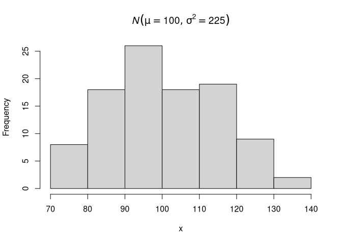
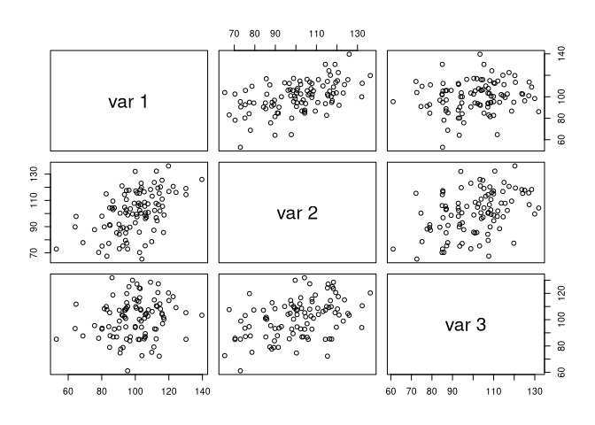
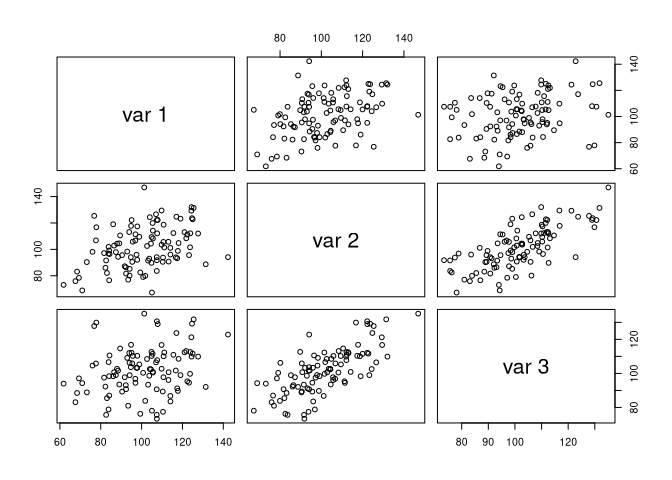

jeksterslabRdata
================
Ivan Jacob Agaloos Pesigan
2020-07-17

<!-- README.md is generated from README.Rmd. Please edit that file -->

<!-- badges: start -->

[](https://travis-ci.com/jeksterslabds/jeksterslabRdata)
[](https://ci.appveyor.com/project/jeksterslabds/jeksterslabRdata)
[](https://codecov.io/github/jeksterslabds/jeksterslabRdata)
<!-- badges: end -->

`jeksterslabRdata` is a collection of functions that I find useful in
studying data generation and sampling.

## Installation

You can install the released version of `jeksterslabRdata` from
[GitHub](https://github.com/jeksterslabds/jeksterslabRdata) with:

``` r
library(devtools)
install_github("jeksterslabds/jeksterslabRdata")
```

## Documentation

See [GitHub
Pages](https://jeksterslabds.github.io/jeksterslabRdata/index.html) for
package documentation.

## Main functions

``` r
library(jeksterslabRdata)
```

### `univ()`

Generates an `n x 1` univariate data vector or a list of `n x 1`
univariate data vectors of length `R`. The default data generating
function is the normal distribution.

#### Single Random Data Set

Run the function.

``` r
x <- univ(n = 100, rFUN = rnorm, mean = 100, sd = sqrt(225))
```

Explore the output.

``` r
str(x, list.len = 6)
#>  num [1:100] 85.7 110.1 99.3 97 117.7 ...
hist(x, main = expression(italic(N)(list(mu == 100, sigma^2 == 225))))
```



#### Multiple Random Data Sets

Run the function.

``` r
xstar <- univ(n = 100, rFUN = rnorm, mean = 100, sd = sqrt(225), R = 100)
```

Explore the output.

``` r
str(xstar, list.len = 6)
#> List of 100
#>  $ : num [1:100] 94.1 86.7 78.5 95.6 95.4 ...
#>  $ : num [1:100] 88.1 104.8 85.3 107.8 108.3 ...
#>  $ : num [1:100] 105.4 103.6 108.2 98.6 78.7 ...
#>  $ : num [1:100] 108.8 117.9 78.7 106.8 87.2 ...
#>  $ : num [1:100] 99.1 107.5 72.2 105.8 89.2 ...
#>  $ : num [1:100] 109.7 95.8 84.1 102.4 101.3 ...
#>   [list output truncated]
```

### `mvn()`

Generates an `n x k` multivariate data matrix or a list of `n x k`
multivariate data matrices of length `R` from the multivariate normal
distribution. This function is a wrapper around `MASS::mvrnorm()`.

#### Single Random Data Set

Set `mu` and `Sigma`.

``` r
mu <- c(100, 100, 100)
Sigma <- matrix(
  data = c(225, 112.50, 56.25, 112.5, 225, 112.5, 56.25, 112.50, 225),
  ncol = 3
)
```

Run the function.

``` r
X <- mvn(n = 100, mu = mu, Sigma = Sigma)
```

Explore the output.

``` r
str(X)
#>  num [1:100, 1:3] 111.1 115.4 100.6 93.8 112.9 ...
#>  - attr(*, "dimnames")=List of 2
#>   ..$ : NULL
#>   ..$ : NULL
psych::pairs.panels(X)
```



``` r
colMeans(X)
#> [1]  99.46826 100.26013 102.41914
cov(X)
#>           [,1]      [,2]      [,3]
#> [1,] 166.44990  91.45500  20.35538
#> [2,]  91.45500 204.94933  82.59958
#> [3,]  20.35538  82.59958 191.54925
cor(X)
#>           [,1]      [,2]      [,3]
#> [1,] 1.0000000 0.4951564 0.1139980
#> [2,] 0.4951564 1.0000000 0.4168832
#> [3,] 0.1139980 0.4168832 1.0000000
```

#### Multiple Random Data Sets

Run the function.

``` r
Xstar <- mvn(n = 100, mu = mu, Sigma = Sigma, R = 100)
```

Explore the output.

``` r
str(Xstar, list.len = 6)
#> List of 100
#>  $ : num [1:100, 1:3] 77.3 100 116.4 93.8 128.1 ...
#>   ..- attr(*, "dimnames")=List of 2
#>   .. ..$ : NULL
#>   .. ..$ : NULL
#>  $ : num [1:100, 1:3] 67.8 92.5 84.3 89 97.1 ...
#>   ..- attr(*, "dimnames")=List of 2
#>   .. ..$ : NULL
#>   .. ..$ : NULL
#>  $ : num [1:100, 1:3] 81.7 95.8 144.2 109.6 89.4 ...
#>   ..- attr(*, "dimnames")=List of 2
#>   .. ..$ : NULL
#>   .. ..$ : NULL
#>  $ : num [1:100, 1:3] 113.4 106.8 69.6 103.2 84.4 ...
#>   ..- attr(*, "dimnames")=List of 2
#>   .. ..$ : NULL
#>   .. ..$ : NULL
#>  $ : num [1:100, 1:3] 100.4 94.9 86.5 99.4 105.2 ...
#>   ..- attr(*, "dimnames")=List of 2
#>   .. ..$ : NULL
#>   .. ..$ : NULL
#>  $ : num [1:100, 1:3] 85.9 84.5 100 91.6 87.5 ...
#>   ..- attr(*, "dimnames")=List of 2
#>   .. ..$ : NULL
#>   .. ..$ : NULL
#>   [list output truncated]
```

### `mvnram()`

Generates an `n x k` multivariate data matrix or a list of `n x k`
multivariate data matrices of length `R` from the multivariate normal
distribution. The model-implied matrices used to generate data is
derived from the Reticular Action Model (RAM) Matrices.

#### Single Random Data Set

Set matrices.

``` r
mu <- c(100, 100, 100)
A <- matrix(
  data = c(0, sqrt(0.26), 0, 0, 0, sqrt(0.26), 0, 0, 0),
  ncol = 3
)
S <- diag(c(225, 166.5, 116.5))
F <- I <- diag(3)
```

Run the function.

``` r
X <- mvnram(n = 100, mu = mu, A = A, S = S, F = F, I = I)
```

Explore the output.

``` r
str(X)
#>  num [1:100, 1:3] 116 90 111 112 125 ...
#>  - attr(*, "dimnames")=List of 2
#>   ..$ : NULL
#>   ..$ : NULL
psych::pairs.panels(X)
```



``` r
colMeans(X)
#> [1] 100.6921 100.5983 100.2144
cov(X)
#>           [,1]      [,2]      [,3]
#> [1,] 180.15563  75.06087  38.30004
#> [2,]  75.06087 231.34699 133.43702
#> [3,]  38.30004 133.43702 193.30805
cor(X)
#>           [,1]      [,2]      [,3]
#> [1,] 1.0000000 0.3676696 0.2052345
#> [2,] 0.3676696 1.0000000 0.6309856
#> [3,] 0.2052345 0.6309856 1.0000000
```

#### Multiple Random Data Sets

Run the function.

``` r
Xstar <- mvnram(n = 100, mu = mu, A = A, S = S, F = F, I = I, R = 100)
```

Explore the output.

``` r
str(Xstar, list.len = 6)
#> List of 100
#>  $ : num [1:100, 1:3] 96.8 88.4 96.2 110.7 93.6 ...
#>   ..- attr(*, "dimnames")=List of 2
#>   .. ..$ : NULL
#>   .. ..$ : NULL
#>  $ : num [1:100, 1:3] 97.2 121.8 98.7 113.2 123.6 ...
#>   ..- attr(*, "dimnames")=List of 2
#>   .. ..$ : NULL
#>   .. ..$ : NULL
#>  $ : num [1:100, 1:3] 106.1 105.3 98.2 117.6 98.7 ...
#>   ..- attr(*, "dimnames")=List of 2
#>   .. ..$ : NULL
#>   .. ..$ : NULL
#>  $ : num [1:100, 1:3] 112.3 99.6 120 87.9 70.2 ...
#>   ..- attr(*, "dimnames")=List of 2
#>   .. ..$ : NULL
#>   .. ..$ : NULL
#>  $ : num [1:100, 1:3] 110 119.4 108 65.4 98.9 ...
#>   ..- attr(*, "dimnames")=List of 2
#>   .. ..$ : NULL
#>   .. ..$ : NULL
#>  $ : num [1:100, 1:3] 102 112.3 91.7 104.4 93.8 ...
#>   ..- attr(*, "dimnames")=List of 2
#>   .. ..$ : NULL
#>   .. ..$ : NULL
#>   [list output truncated]
```
